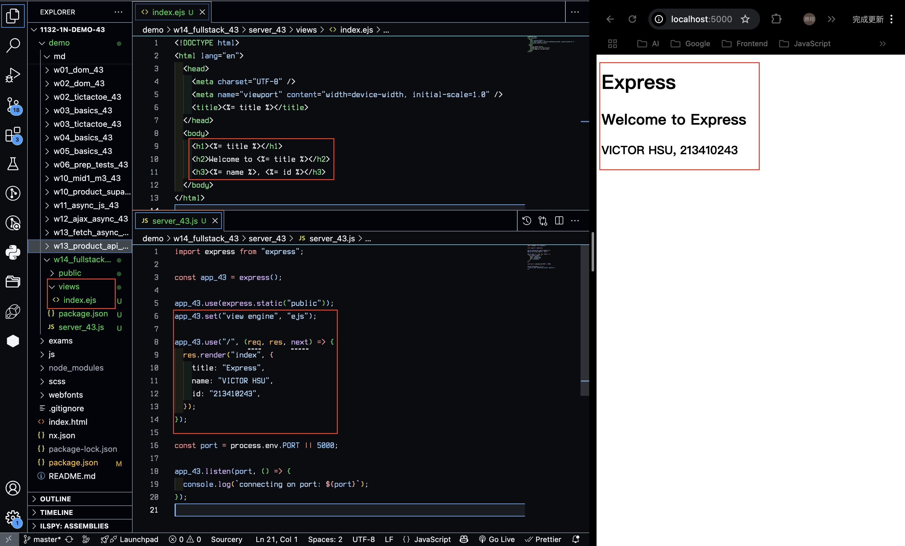
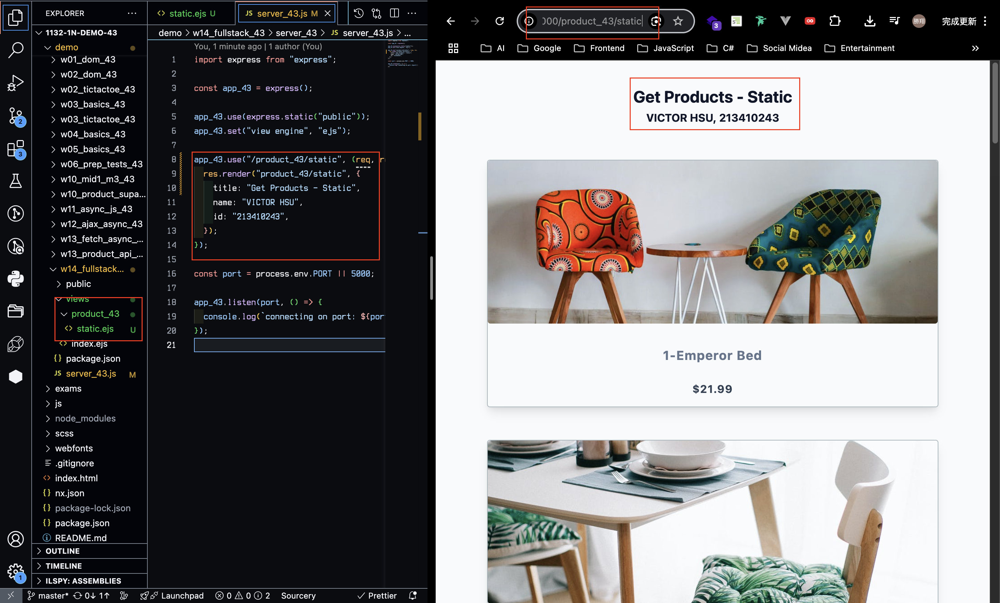
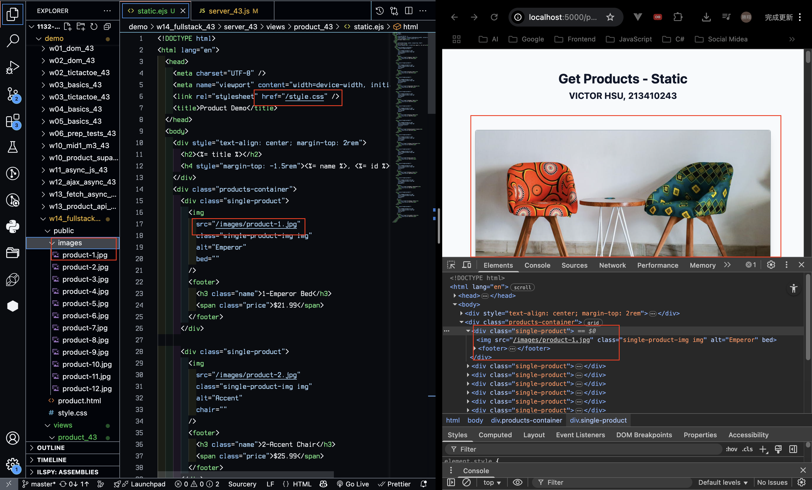
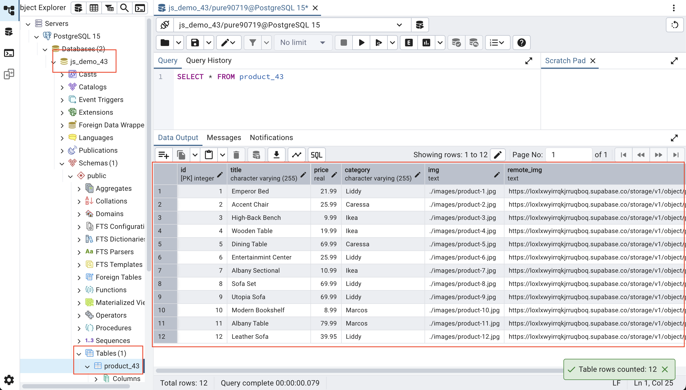
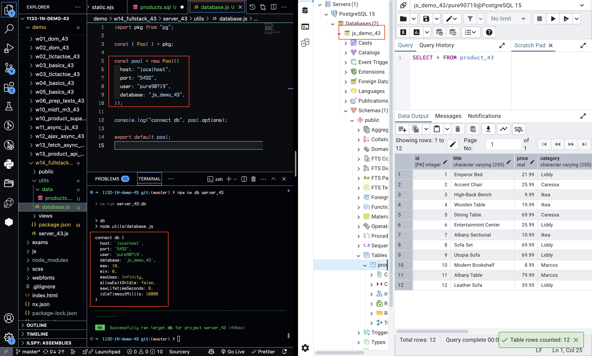
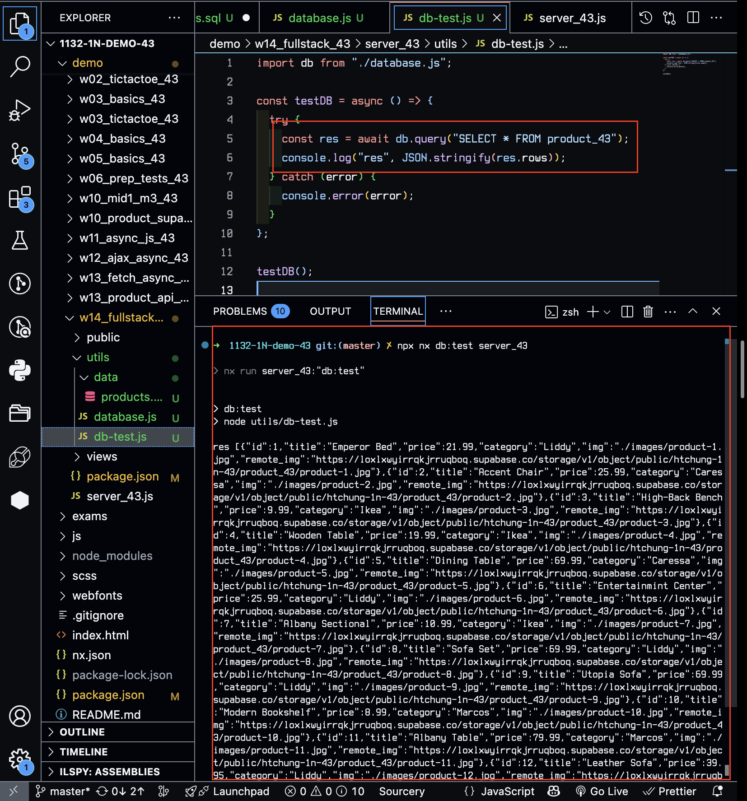
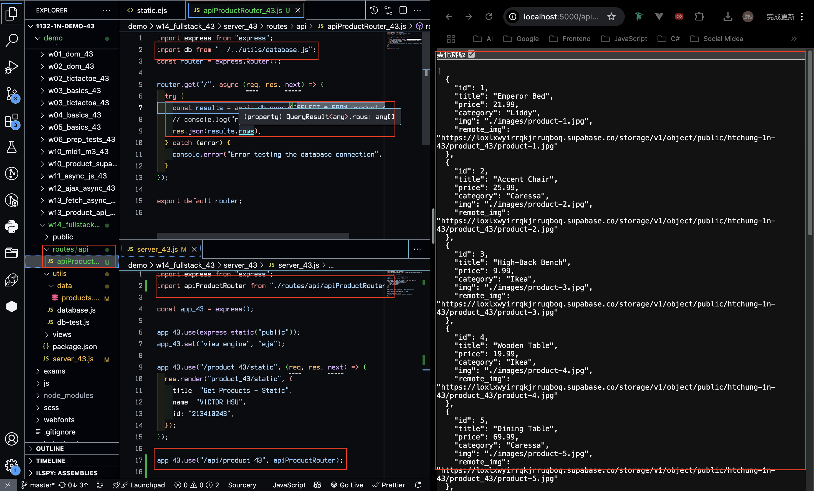
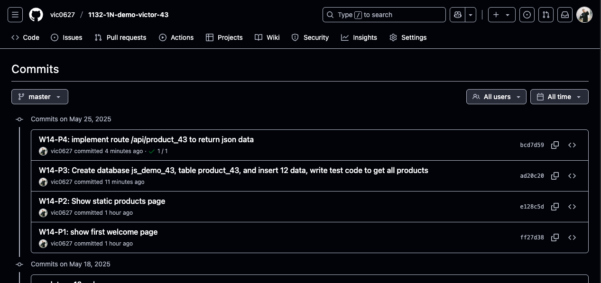

[GitHub URL](https://github.com/vic0627/1132-1N-demo-victor-43)
[Vercel URL](https://1132-1n-demo-victor-43.vercel.app)

### W14-P1: show first welcome page



```
ff27d38 victor_xu       Sun May 25 16:02:50 2025 +0800  W14-P1: show first welcome page
```

### W14-P2: Show static products page

#### => show render page with data passed into ejs page



#### => show how the product-1.jpg can be accessed fro public directory as root directory



```
e128c5d victor_xu       Sun May 25 16:12:02 2025 +0800  W14-P2: Show static products page
```

### W14-P3: Create database js_demo_43, table product_43, and insert 12 data, write test code to get all products

#### => Create database js_demo_43, table product_43, and insert 12 data



#### => connect js_demo_43 database



#### => get all product data



```
ad20c20 victor_xu       Sun May 25 17:11:42 2025 +0800  W14-P3: Create database js_demo_43, table product_43, and insert 12 data, write test code to get all products
```

### W14-P4: implement route /api/product_xx to return json data



```
bcd7d59 victor_xu       Sun May 25 17:18:10 2025 +0800  W14-P4: implement route /api/product_43 to return json data
```

### W14-logs: git logs of W14


